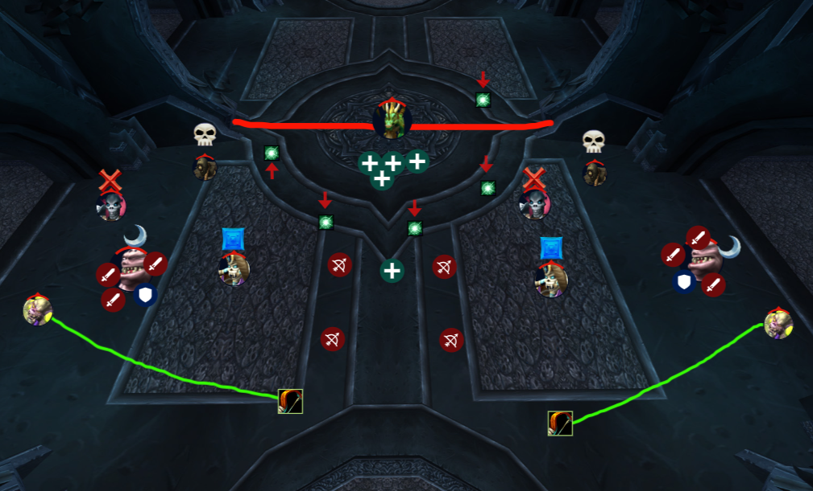

# Valithria Dreamwalker

The fight will start by us killing 4 archmages around the Dragon. After they are
dead you will split to your designated side with a tank and stay there. DO NOT 
DEVIATE FROM YOUR SIDE!!! DO NOT GO PAST THE DRAGON TO THE BACK OF ROOM. STAY 
BEHIND the line drawn in RED. As enemies start to come out from the sides you
will have to follow a kill order.

1. Suppressors (💀)
2. Blazing Skeleton (❌)
3. Risen Archmage (🟦)
4. Aboms (🌙). 

**YOU MUST FOLLOW THIS KILL ORDER.**

Suppressors will reduce all healing done to the Dragon by a significant amount
if not killed prolonging the fight. Blazing Skeletons do an AOE to the entire
raid that hurts like hell. Archmages will frost bolt the entire raid slowing our
movement. Aboms are a truck and will hit you like a truck. Only the tank should
be on aboms until there is nothing left in the kill order to kill. Once an Abom
dies it will explode releasing several Rot Worms. Rogues you need to TOT these 
to the tank on your side or they will go wild killing people. Cleave them down
once on tank.

HUNTERS - Your job is the Blistering Zombie. It will more than likely be
targetting a healer and moves fast. You MUST distracting shot them to you and
kite them away from the raid while killing them. Use concussive shot to slow
them and DK's can Chains of Ice them to help. When they die they will explode
dealing AOE damage so please try not to kill it in the middle.

There will be 1-2 healers outside to do dispells and keep the raid outside up
while the inside healers have their job.

INSIDE HEALERS-This is your fight. Your job is literally to heal the Dragon to
100% Health. You will need to stay together and once the Dragon summons
nightmare portals (red arrows) you need to all be at the SAME portal for when it
opens. Once it opens all of you go in and stay grouped up. You will have a
follow target inside. Once inside you will be flying in the air and need to move
through the orbs as a group to gain stacks of Emerald Vigor. This stacking buff
will increase your healing by 10% per stack you have. Move around the dragon
collecting the Vigor Orbs and again REMAIN TOGETHER. When an orb pops it will
give everybody within range of it the healing buff. You need to make sure all of
you inside get stacks. Remember to keep healing yourself with HoTs or instant
cast heals while inside as each stack you gain will also deal damage to you
while inside. Once you come out reposition at the front of boss and continue
healing her until the next set of portals open. Rinse and Repeat until boss is
fully healed.
