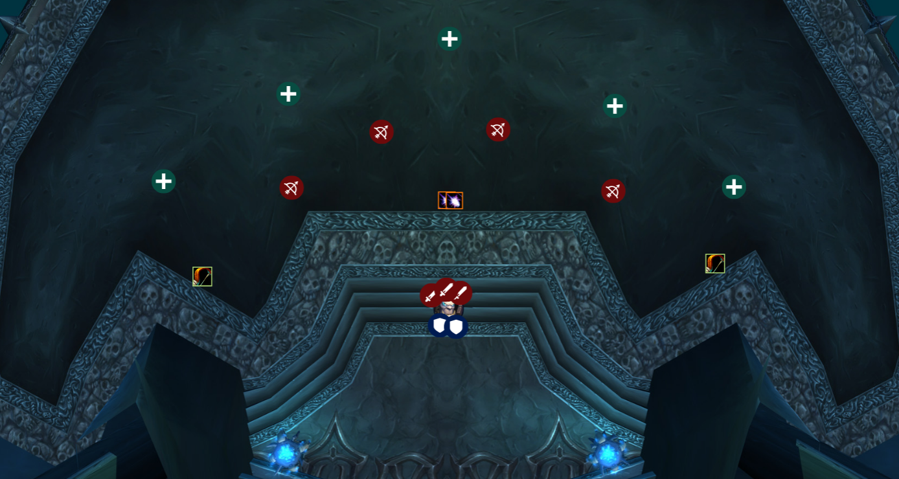
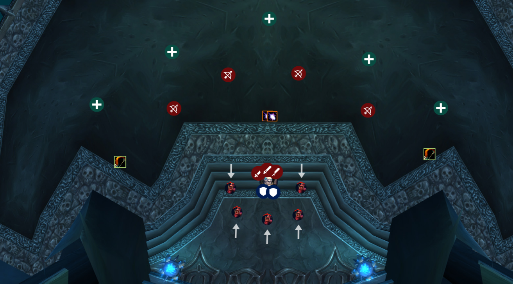
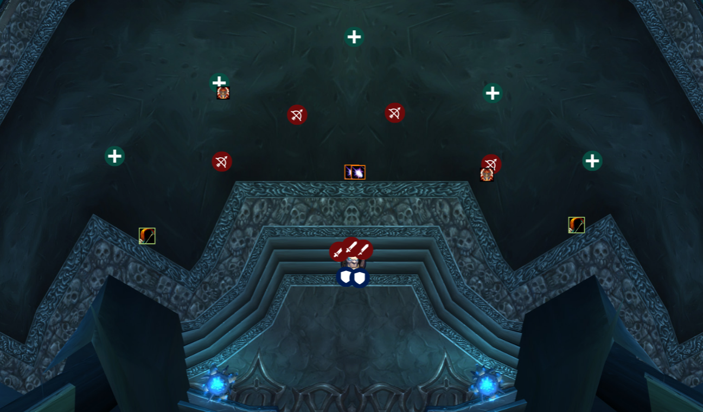

# Deathbringer Saurfang

When the fight starts we should be positioned something like this. 
Spread out and give each other room for the ability [Blood Nova](https://www.wowhead.com/spell=72378/blood-nova) and [Boiling Blood](https://www.wowhead.com/wotlk/spell=72385/boiling-blood) `/range 12` to be sure.

Everybody will burn the boss for a period of time until he spawns [Blood Beasts](https://www.wowhead.com/npc=38508/blood-beast)

Tanks you need to coordinate with each other on who is starting with the boss.
During the fight you will have to taunt swap between each other based on a 
certain mechanic. 
When the first tank tanking the boss gets [Rune of Blood](https://www.wowhead.com/spell=72410/rune-of-blood) the other tank needs to 
taunt off the Main tank immediately so that the boss isn't hitting the 
Blood target. 
Doing so causes him to generate [Blood Power](https://www.wowhead.com/spell=72371/blood-power) much more quickly 
Once the second tank gets Rune of Blood the First tank will taunt it back.
Rinse repeat for tanks.

When the boss summons [Blood Beasts](https://www.wowhead.com/npc=38508/blood-beast) there will be 5 of them on Heroic.
They do a raid wide ability called [Scent of Blood](https://www.wowhead.com/wotlk/spell=72769/scent-of-blood)
Hunters need to run up before they spawn and drop frost traps in the area where
they spawn to slow them down. 
Once they spawn Boomies need to Typhoon to push the adds back to the door. 
Once these steps are done **ALL DPS except for Rogues and Cats** need to 
swap to Blood Beasts and NUKE them. 
The faster they die the better for the fight. 
**DO NOT let a blood beast hit you.** 
They hit significantly hard and will generate more Blood Power on the Boss. 
Rinse repeat for each set of Blood Beasts that spawn.

Once the boss reaches 100 Blood Power he will target 1 random person and apply 
[Mark of the Fallen Champion](https://www.wowhead.com/spell=72293/mark-of-the-fallen-champion). The Holy Paladin needs to beacon this first mark 
and continue healing the tanks. All other healers need to help keep that target
alive. If the marked target dies the boss will regenerate health. The second 
mark that comes out needs to get Earth Shield applied to it by the Resto Sham 
and again all heals need to help keep both those targets alive. 
Any other marks need to get focus heals and be kept alive the entire duration 
of the fight. Even loosing 1 Mark to death can mean a wipe for the raid.

If you have [Mark of the Fallen Champion](https://www.wowhead.com/spell=72293/mark-of-the-fallen-champion) you can NO LONGER ATTACK blood beasts.

If a caster has a Mark, paladins can mitigate some of the physical damage taken
by the marked player by casting Hand of Protection on them to avoid the player
dying, and giving health back to Deathbringer Saurfang.
