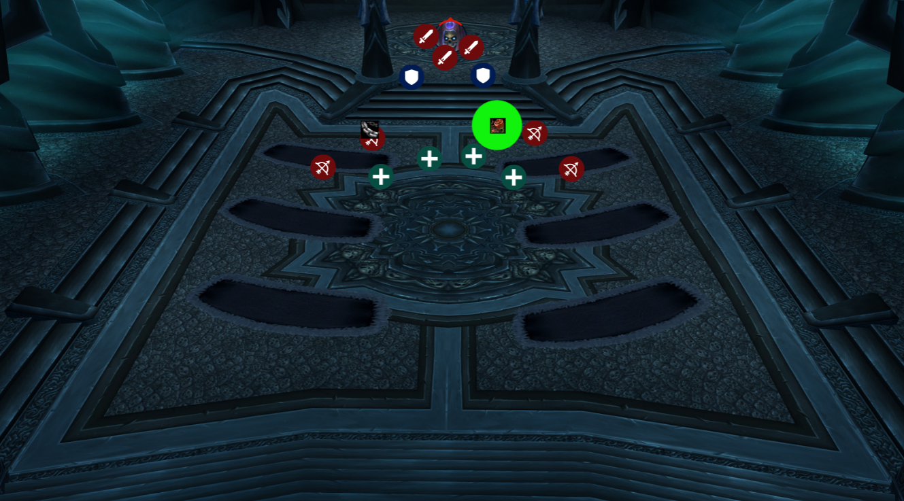
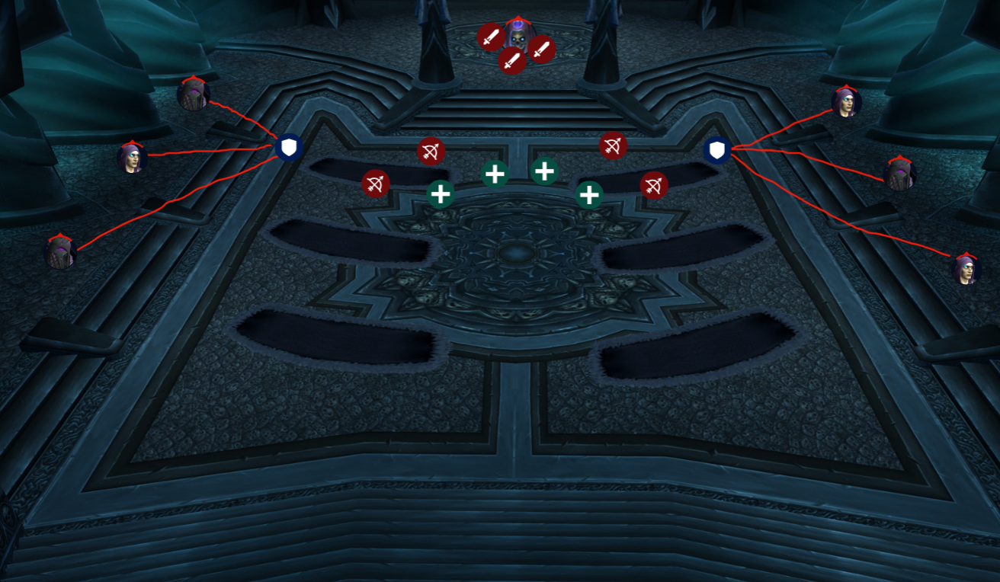

# `Lady Deathwhisper`

Lady Deathwhisper is the second boss in ICC and is usually done on normal
even when guilds have killed Lich King 25HC as this is one of the more challenging
fights to do on heroic.

- Druids need to cyclone the Mind Controlled targets fast
- Melee **must** be using equipment manage and have a `pve` set so that 
DBM can unequip your weapons automatically if you get Mind Controlled
- Kill adds fast (rogues and hunters must be doing Misdirection and Tricks of 
the Trade to each side of the room's tank)
- Interrupt Frostbolt Volley
- Don't let the spirits touch you and explode for raid wide damage

## Phase 1

The first phase of this fight, Lady Deathwhisper will have her 
[Mana Barrier](https://www.wowhead.com/wotlk/spell=70842/mana-barrier) up,
which will replenish her health at the expense of her mana. This phase will last
until her mana bar is depleted.

She will periodically drop
[Death and Decay](https://www.wowhead.com/wotlk/spell=71001/death-and-decay)
on the floor, which if possible, should avoid standing in. Druids must also
Cyclone Mind Controlled targets before they start killing raid members.

She will start to spawn adds 10 seconds into the fight, and every 45 seconds
after the first wave. She will spawn Cult Fanatics and Cult Adherents. 
Everyone must swap to killing adds.

### Cult Fanatics

Fanatics will deal primarily deal melee damage and must be picked up by tanks
quickly as they will melee swing for about 40k damage before damage filtering
and reductions. Tanks must also face this mob away from the raid as they will
use [Shadow Cleave](https://www.wowhead.com/wotlk/spell=70670/shadow-cleave)
periodically and cleave all members for ~20k damage who are infront of the mob.
Adherents also will cast [Necrotic Strike](https://www.wowhead.com/wotlk/spell=70659/necrotic-strike)
which will do 70% of weapon damage and apply a healing absorb effect of 20k, 
meaning the next 20k of healing received by the tank will not actually heal
them. Focus healing the tanks while this debuff.

> Dark Transformation

This mob can cast [Dark Transformation](https://www.wowhead.com/wotlk/spell=70900/dark-transformation)
and will turn into a `Deformed Fanatic`, dealing 200% of their normal damage 
values, and have their run speed reduced by 50%. This mob must be kited by the
tank whos side this mob converted on or they will get slapped.

At 25% health, adherents will get a buff called 
[Vampiric Might](https://www.wowhead.com/wotlk/spell=70674/vampiric-might) which
increases all damage done by 300%. Mages can spell steal this buff.

### Cult Adherent

Adherents are caster-like adds and cast 
[Deathchill Bolt](https://www.wowhead.com/wotlk/spell=70594/deathchill-bolt),
which should be interrupted. These mobs periodically put 
[Curse of Topor](https://www.wowhead.com/wotlk/spell=71237/curse-of-torpor)
which increases the target's cooldowns on all abilities by 15 seconds.
This mob has a same effect as the `Cult Fanatics` where they can convert to
an empowered mob, `Empowered Adherent`, and deal 30% more damage and their casts
are no longer interruptable.

> Dark Martyrdom
Both cultists can cast [Dark Martyrdom](https://www.wowhead.com/wotlk/spell=70903/dark-martyrdom)
which deals 25k damage to all enemies within 15 yards. Afterwards, a `Reanimated`
mob type will spawn, either Fanatic or Adherent and are immune to either magical
or physical damage. `Reanimated Fanatics` are immune to physical damage and must
be killed by magical damage, and `Reanimated Adherents` are immune to magical damage,
and must be killed by melees.

## Phase 2

Once Lady Deathwhisper's mana bar hits 0, phase 2 starts. Rogues and hunters
must keep MD/TOT up to the main tank during this phase as she will apply
[Touch of Insignificance](https://www.wowhead.com/wotlk/spell=71204/touch-of-insignificance)
on the tank, which will reduce the tank's ability to generate threat by 20%
for each stack, up to 5 stacks (100% threat reduction). She will also cast
[Frostbolt Volley](https://www.wowhead.com/wotlk/spell=72905/frostbolt-volley),
dealing 14.4k damage, and should be interrupted by people who have ~8 second
cooldown interrupts (DKs, rogues, warriors etc). She will continue to cast 
Mind Control and drop Death and Decay, so keep this in mind.

She will now spawn `Vengeful Shade`s, which must be kited or will deal
large amounts of raid wide damage to where ever the Shade touched the target
for ~23k for all players within 20 yards of the explosion.
This is usually where raids wipe, so please be mindful of where
the Shades spawn. Tanks must move the boss around the room to increase
the ability of people to successfully kite the shades.

## Better Vengeful Shade Visibility

If you are having a hard time seeing the Vengeful Shades, download
the `./assets/patch-z.mpq` file and place it in your `${WOW_DIRECTORY}/Data` folder.
It will turn the Vengeful Shades to a bright white color.
