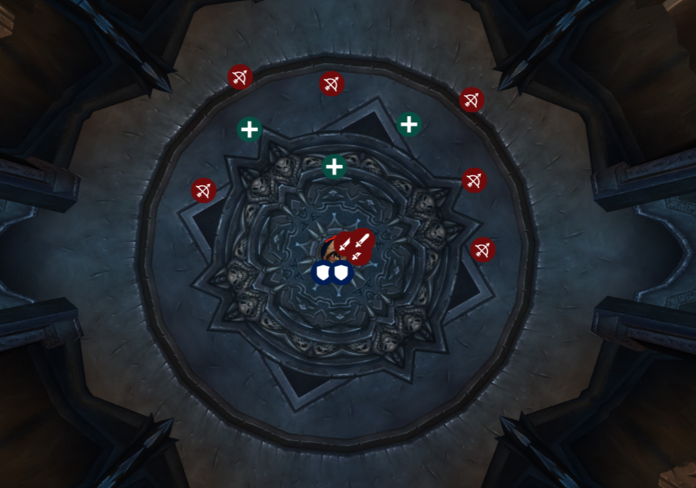
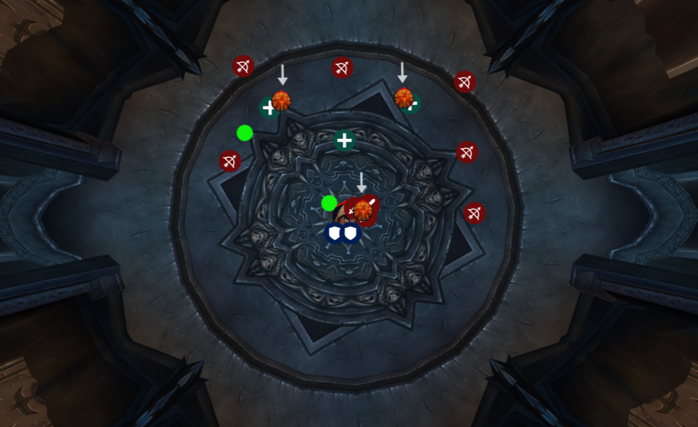

# `Festergut`

When the fight starts we want to position ourselves similar to this. 

Make sure you are spread out at least `/range 12` so that you 
don't [Vile Gas](https://www.wowhead.com/wotlk/spell=69240/vile-gas) someone else. 
Vile Gas will cause you to throw up and make anybody within range of you also throw up,
dealing damage, and stunning the player.

During the fight the boss will cast 3 [Gas Spores](https://www.wowhead.com/wotlk/spell=69279/gas-spore) onto random people. 
There needs to be 1 spore in the melee and 2 out in ranged like so. 

Spores are marked with arrows. 
**DO NOT stack 2 spores together.** 
Once the spores pop you will get a debuff that helps mitigate damage in a 
later part. Range need to spread back out `/range 12` for [vile gas](https://www.wowhead.com/wotlk/spell=69240/vile-gas) after the 
spore pops. 

During the entire encounter you need to watch your feet for a small green pool. 
This is a [Maleable Goo](https://www.wowhead.com/wotlk/spell=72297/malleable-goo) coming your way. You need to move away from that spot 5 
yards or it will hit you dealing damage and reducing your melee/cast speed by 250%

Melee you will have a target to stay stacked with for this. 
Everybody should start on either the right or left leg of the boss. 
If a maleable is thrown to the leg you are at you move to the other leg. 
Simple as that. 

If not solo tanking-The first tank will take the boss and gain stacks of [Gastric
Bloat](https://www.wowhead.com/wotlk/spell=72219/gastric-bloat). Once the first tank has reached 8 stacks the second tank will need to
Taunt the boss and take it for the remainder of the fight. 
If you get to 10 stacks you will explode and wipe the raid. 
Also remember the more stacks of Bloat you have the more damage you are going
to take. Be ready to call for external defensives or use your own defensives 
for this.

Once 3 sets of [spores](https://www.wowhead.com/wotlk/spell=69279/gas-spore) have come out and been dealt with the boss will begin to
use [Pungent Blight](https://www.wowhead.com/wotlk/spell=69195/pungent-blight). The spore debuff you get when they pop helps mitigate this 
damage. The more debuffs you have the better. At this time the Hpala will need
to Dsac and then bubble themselves to absorb the damage it does. 
Mages can Ice Block, Shadow Priests can Dispersion and stay until pungent ends. 
Rinse and repeat all mechanics until boss is dead unless told otherwise.
