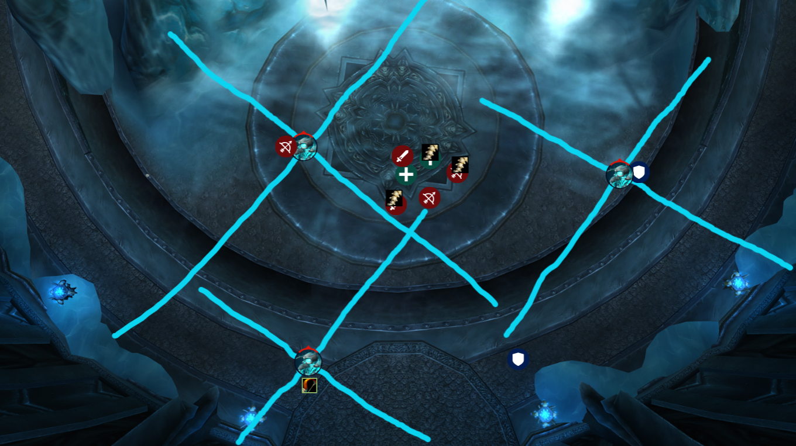

# `Lord Marrowgar`

Lord Marrowgar is the first boss in ICC and only has a few basic mechanics.

- Don't stand in [Coldflame](https://www.wowhead.com/wotlk/spell=69146/coldflame)
- Break Bone Spikes fast (especially during Bone Storm)
- Tanks stack together
- Hunter bait boss's Bone Storm

## Phase 1
In this encounter, all DPS and Healers will stack behind the boss, 
as close as possible to negate the effect of standing in 
[Coldflame](https://www.wowhead.com/wotlk/spell=69146/coldflame).
The only person who will not stack will be the hunter. The hunter will stay at
the back of the room.

Tanks must be stacked together as Marrowgar does a cleave via 
[Bone Slice](https://www.wowhead.com/wotlk/spell=69055/bone-slice) where the
2 nearest players to the main tank will share 300% of Marrowgar's melee swing,
roughly **51,005 to 69,538** in unfiltered damage (armor, any additional damage 
reduction auras etc).

Here are the starting positions:

Lord Marrowgar will periodically cast 
[Bone Spike Graveyard](https://www.wowhead.com/wotlk/spell=69057/bone-spike-graveyard)
on 3 players. The majority of the Spikes will be on the players who are stacked
under the boss. Everyone should be swapping to spikes, but periodically,
Marrowgar will target the hunter. Range DPS must switch to the spiked hunter to
free them as melee will take longer to get there and Coldfire might be in the way.

## Bone Storm

Lord Marrowgar will begin to cast [Bone Storm](https://www.wowhead.com/wotlk/spell=69076/bone-storm) after several rounds of Bone Spike Graveyard.

When the cast goes off, Marrowgar should spin towards the Hunter, who is standing
at the entrance of the room. Here, the off-tank should move closer to the door,
and another range DPS should move to the west side of the room to get Marrowgar
to move towards them so that Marrowgar continually "bounces" across the room.

Every 2 seconds during
[Bone Storm](https://www.wowhead.com/wotlk/spell=69076/bone-storm), Marrowgar
will cleave all near by enemies for 14,000 physical damage, so be sure to move
away if he approaches you. While bone storm is going on, he will continue to 
put players in Bone Spikes, so be sure to prioritize getting people out of the
spikes. In addition, Marrowgar will continue to drop Coldflame, so be
sure to not stand it in (-11k damage per second).

Once Bone Storm ends, repeat the opening phase of the fight, where tanks will
stack infront of the boss, and everyone except the hunter will stack under the
boss ASAP.

## Cooldowns

Here are some brief notes on cooldown management during the encounter:

- First Bone Storm, the Holy Paladin should DSac and the Retribution
paladin can Frost Aura + Aura Mastery to mitigate the frost damage from Coldflame.
- Holy Paladin should pop Glowing Twilight Scale (GTS) and Divine Illumination
for increased Area of Effect Healing
- Second Bone Storm, the Protection Paladin should DSac.
